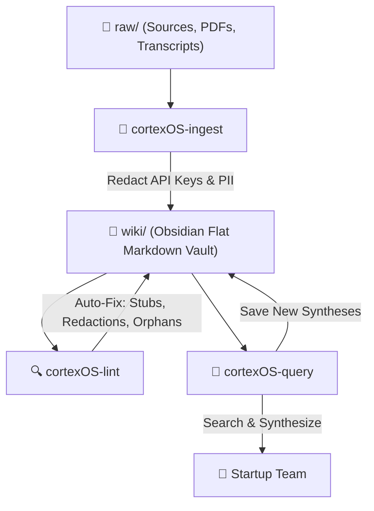

# 🧠 CortexOS Agent Skills

[](https://www.npmjs.com/)
[](https://opensource.org/licenses/MIT)
[](#-local-security-guardrails)

> Turn your AI coding assistants (Google Antigravity, Claude Code, and Claude Desktop) into a powerful, local, self-optimizing **Tech-Startup Second Brain**.

CortexOS provides a collection of four production-grade agentic skills designed to orchestrate, ingest, search, and audit startup wikis and local knowledge bases. It enforces strict Obsidian-style cross-linking, flat flat-directory layouts, and zero-leak security guardrails.

---

## 🗺️ System Data Flow



---

## ⚡ Quick Start: Zero-Config Installation

You can install agent skills globally and locally in a single command using the custom `skills` CLI wrapper:

### Install CortexOS Skills
```bash
npx skills add https://github.com/heysourin/CortexOS --skill '*'
```

### 🔍 How it Works Under the Hood
Running this command automatically:
1. Performs a fast, shallow clone of the remote GitHub repository into a temporary directory.
2. Scans for active skill definitions containing proper YAML frontmatter.
3. Automatically installs them into the following global and project-specific directories:
   - **Google Antigravity:** `~/.agents/skills/` (Global) & `./.agents/skills/` (Local Project)
   - **Claude Desktop / Code CLI:** `~/.claude/skills/` (Global) & `./.claude/skills/` (Local Project)

---

## 🛠️ The 4 Core Skills

| Skill | Target Agent Role | Trigger Phrases / Intent | Key Functionality |
| :--- | :--- | :--- | :--- |
| **`cortexOS`** | **Startup Onboarding** | "start onboarding", "onboard me" | Parses domain description, load corporate tags, and sets the active startup persona. |
| **`cortexOS-ingest`** | **AI Librarian** | "process source", "ingest data", "added to raw/" | Automatically structures files into uniform flat-layout wiki notes under `wiki/` and updates indices. |
| **`cortexOS-lint`** | **Security & Integrity Auditor** | "audit wiki", "lint", "health check" | Scans the wiki for broken links, orphan pages, contradictions, stale claims, and exposed secrets. |
| **`cortexOS-query`** | **Knowledge Retriever** | "what do we know about...", "query wiki" | Answers complex search queries using deep citations, and saves syntheses back into the index. |

---

## 📖 Skill Spotlights

### 1. 🧠 `cortexOS` (Onboarding & Core Domain)
Initializes your workspace's AI agent with the context, vision, and domain guidelines of your startup. It ensures the agent is perfectly aligned with company-specific rules from day one.

### 2. 🚀 `cortexOS-ingest` (Ingestion Workflow)
Ingests raw notes, transcripts, and web clippings into structured markdown pages.
- **Categorization:** Maps documents to **10 Canonical Startup Tags** (e.g. `strategy`, `product-spec`, `engineering`, `sales-crm`).
- **Standardized Layouts:** Output notes feature clear TL;DR summaries, key takeaways, deep dives, action items, and linkable references.
- **Automated Logging:** Documents every ingestion step in `wiki/log.md`.

### 3. 🛡️ `cortexOS-lint` (Integrity & Security Auditor)
Runs automated health checks over your second brain.
- **Wikilink Validation:** Flags broken `[[links]]` and automatically creates stub pages for missing references.
- **Security Scanner:** Audits wiki content for unmasked PII, exposed `.env` variables, and plaintext secrets (e.g. `API_KEY=`, credentials, etc.).
- **Orphan Finder:** Flags pages with no inbound links so that no intelligence is lost or siloed.

### 4. 🔍 `cortexOS-query` (Obsidian-Style Search Engine)
Answers queries using a combination of flat-file scanning and high-speed semantic search.
- **Deep Citations:** Generates rich contextual answers with inline references like `[[product-roadmap]]`.
- **Knowledge Synthesis:** Automatically offers to save synthesized answers (e.g. competitor comparison matrices) directly back into the wiki.

---

## 🔒 Local Security Guardrails

CortexOS was designed with **Privacy First** principles. Your commercial IP and PII never leave your computer:
* **Redaction Engine:** All API keys, credentials, private emails, and phone numbers are automatically masked during ingestion with `<masked-api-key>` placeholders.
* **100% Local Processing:** Files are processed using local tools. No data is sent to external, unverified services.
* **Shared File Safeguards:** Audits `.gitignore` compliance to prevent configuration files (`.env`) or internal spreadsheets from being tracked in public git repos.

---

## 📝 License
Distributed under the MIT License. See [LICENSE](LICENSE) for more information.# CortexOS
